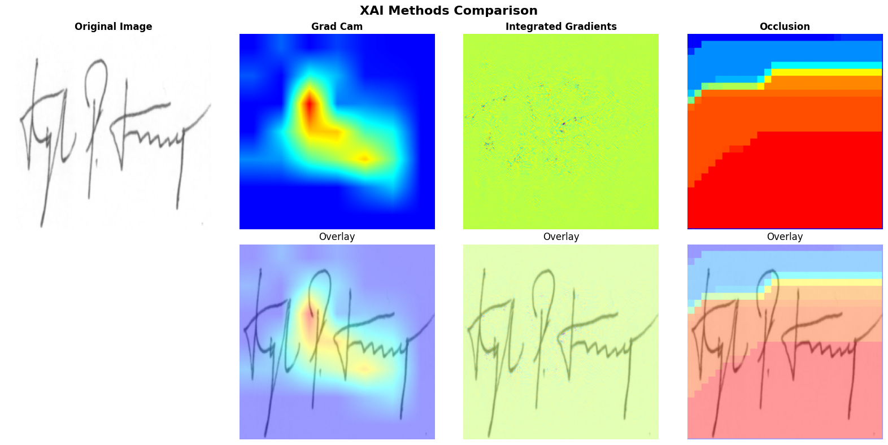

# eXplainability for Signature Detection


[](https://colab.research.google.com/drive/1e5jzM24HvvN1H24wCzDDbm-2Bm-9yUkS?usp=sharing)

## 🎯 Project Overview

This project serves as the capstone for the Professional AI Master's program in AI Engineering. It demonstrates the integration of modern deep learning techniques with explainable AI methods to create an interpretable signature classification system.

### Key Features

- **Signature Classification**: Binary classification for signature authentication using the CEDAR dataset
- **Explainable AI**: Integration of XAI techniques (Grad-CAM, Integrated Gradients, etc.) for model interpretability
- **Modular Architecture**: Clean, extensible codebase with separation of concerns
- **Comprehensive EDA**: Detailed exploratory data analysis with automated reporting
- **Model Factory**: Support for multiple architectures (CNN, ResNet50, etc.)
- **Configuration-Driven**: YAML-based configuration management
- **Robust Data Pipeline**: Automated data loading, preprocessing, and augmentation

## 🚀 Getting Started

### Installation

1. Clone the repository:
```bash
git clone https://github.com/silvano315/eXplainability-for-signature-detection.git
cd eXplainability-for-signature-detection
```

2. Install dependencies:
```bash
pip install -r requirements.txt
```

3. Set up Kaggle API credentials:
   - Place your `kaggle.json` file in `~/.kaggle/`
   - Ensure proper permissions: `chmod 600 ~/.kaggle/kaggle.json`

### Usage

#### Quick Start with Jupyter Notebook

The easiest way to run the complete project is through the main notebook:

```bash
jupyter notebook XAI_project_notebook.ipynb
```

Or you can see this notebook on [Google Colab](https://colab.research.google.com/drive/1e5jzM24HvvN1H24wCzDDbm-2Bm-9yUkS?usp=sharing).

#### Step-by-Step Usage

1. **Configuration**: Modify `config/config.yaml` to adjust training parameters, model settings, and data paths.

2. **Data Preparation**: The dataset will be automatically downloaded from Kaggle.

3. **Exploratory Data Analysis**: Generate comprehensive EDA reports.

4. **Model Training**: Use the modular training pipeline.

5. **Model Evaluation**: Comprehensive testing and visualization.

6. **Explainability Analysis**: Advanced XAI with multiple methods.

## 📊 Dataset

For this project, the master's teacher gave the possibility of choosing a dataset of images of our choice (possibly connected to the banking world) and I chose a challenging dataset that could be an excellent use case for the banking environment: signatures true vs false signatures. The project uses the **CEDAR signature dataset** from Kaggle:
- **Source**: `shreelakshmigp/cedardataset`
- **Total Images**: 2,640 signatures
- **Classes**: Binary classification (genuine vs. forged signatures)
- **Signers**: 55 different subjects
- **Distribution**: 1,320 genuine + 1,320 forged signatures (perfectly balanced)
- **Image Format**: Converted to RGB, normalized to 224×224 pixels

### Dataset Statistics
- **Samples per signer**: 24 genuine + 24 forged signatures
- **Train/Val/Test split**: 70%/15%/15% (subject-level separation)
- **Training set**: 1,846 images (923 genuine, 923 forged)
- **Validation set**: 396 images (198 genuine, 198 forged)
- **Test set**: 398 images (199 genuine, 199 forged)

## 🤖 Models

The project supports multiple model architectures through a factory pattern:

### Available Models
- **BaselineCNN**: Custom CNN with batch normalization and dropout
  - 3 convolutional blocks with max pooling
  - Adaptive average pooling
  - Fully connected classifier with dropout
  
- **ResNet50**: Pre-trained transfer learning model
  - ImageNet pre-trained weights
  - Custom classifier head
  - Fine-tuning capabilities
  
- **Extensible Architecture**: Easy addition of new models through factory pattern

### Model Performance Comparison

I preferred not to focus excessively on the evaluation and comparison of the models because the objective of the project was XAI. Basically, as expected, the Baseline CNN model performed worse than the pre-trained ResNet50. The performances were satisfactory for both, the basic model exceeded 80% both in evaluation and on the test set. The transfer learning model achieved performance of 99%.

## 🔍 Explainable AI

Comprehensive integration of XAI techniques with visual comparison tools:

- **Grad-CAM**: Gradient-based class activation mapping for visual attention
- **Integrated Gradients**: Attribution-based explanations for feature importance
- **Occlusion**: Systematic feature removal for understanding critical regions
- **SignatureExplainer**: Custom explainer class for signature-specific analysis
- **XAIVisualizer**: Advanced visualization tools for method comparison
- **TestImageSelector**: Interactive tool for analyzing specific test samples

## 📈 Training & Evaluation Pipeline

Qui dovrei descrivere nei minimi dettagli tutta la bellissima pipleine dell'esperimento, che permette di effettuare il training in maniera completa potendo settare qualsiasi configurazione possa essere richiesta, con un sistema di callback ben collaudato, un sistema di log file che permette il controllo costante di tutte le metriche analizzate, il salvataggio in tempo reale di tutti i risultati e i modelli (con pesi e optimizer), una pipeline di evaluation e analisi dei risultati sul test set con grafici e risultati numerici. Ma preferisco consigliarvi nuovamente di testare quanto appena detto tramite il [notebook](XAI_project_notebook.ipynb) e i moduli della cartella [src](src/) perchè solo così è possibile rendersi conto del meraviglioso potere di questa pipeline.

## 📊 Results from XAI

### Model eXplanations

XAI implementation successfully provides interpretable insights into how the model distinguishes between genuine and forged signatures. The following image shows how different explainability methods on a forged signature sample (that was correctly classified by the model) could provide.

<div align="center">

</div>

1. Grad-CAM Analysis reveals focused attention on the central portion of the signature, specifically highlighting the letter "P". The model correctly identifies that this letter appears smaller and positioned differently compared to genuine signatures from the same subject.
2. Integrated Gradients provides pixel-level attribution with more distributed importance across the signature. It offers granular details, but it seems not so informative respect to GRAD-CAM.
3. Occlusion Maps shows spatial sensitivity analysis with highest importance (red zones) concentrated in the right portion of the signature that confirms where the critical discriminative features are located in specific regions.

### Key Achievements

- **Near-perfect accuracy** with ResNet50 transfer learning (over 99%)
- **Robust baseline** performance with custom CNN (over 80%)
- **Comprehensive XAI analysis** with multiple explanation methods
- **Subject-level data splitting** ensuring realistic evaluation
- **Implemented Robust Multi-Method XAI Validation** with 3 method captures different aspects (global attention, pixel-level attribution, spatial sensitivity)
- **The XAI analysis** provides forensic-level details about specific signature elements that indicate forgery, going far beyond a simple genuine/forged classification

## 📄 License

This project is licensed under the Apache License 2.0 - see the [LICENSE](LICENSE) file for details.

## 🙏 Acknowledgments

- **CEDAR Dataset**: Thanks to the creators of the CEDAR signature dataset
- **Profession AI Master's Program**: AI Engineering track
- **PyTorch Community**: For the excellent deep learning framework
- **Kaggle**: For hosting the dataset and providing the API

---
